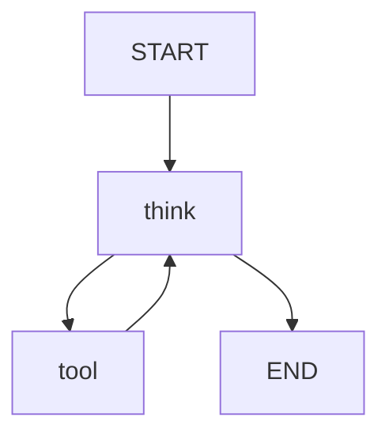

# 01 - 为什么需要 LangGraph？

> **核心理念**：从单次调用到循环推理，让 AI 变成真正的 Agent

## 🎯 学习目标

- 理解传统 LangChain 的局限性
- 认识 LangGraph 解决的核心问题
- 理解 Agent 的本质：循环推理
- 掌握状态机的基本概念

---

## 📝 第一阶段的局限性

### 问题 1：没有循环推理

还记得第一阶段的天气助手吗？我们需要**手动**实现循环：

```typescript
// ❌ 第一阶段：手动写循环
async chat(userInput: string): Promise<string> {
  const messages = [new HumanMessage(userInput)];

  while (true) {  // 👈 手动写循环
    const response = await this.llm.invoke(messages);
    messages.push(response);

    if (!response.tool_calls || response.tool_calls.length === 0) {
      return response.content as string;
    }

    // 手动执行工具...
    for (const toolCall of response.tool_calls) {
      const tool = this.tools.find(t => t.name === toolCall.name);
      const result = await tool.invoke(toolCall.args);
      messages.push(new ToolMessage({...}));
    }
  }
}
```

**问题**：

- ❌ 循环逻辑散落在代码各处
- ❌ 难以追踪执行流程
- ❌ 无法可视化
- ❌ 无法暂停/恢复

---

### 问题 2：无法处理复杂流程

假设需求变复杂了：

```typescript
// 用户："帮我订一张去上海的机票"

// 期望的执行流程：
// 1. 查询航班 → 如果有票，跳到步骤2；如果没票，推荐其他城市
// 2. 计算价格 → 如果超预算，询问用户；否则继续
// 3. 确认订单 → 等待用户确认
// 4. 支付 → 调用支付接口
// 5. 发送确认邮件
```

用第一阶段的方法，你需要写大量的 `if/else`：

```typescript
// ❌ 难以维护的代码
if (需要查航班) {
  const flights = await searchFlights();
  if (flights.length === 0) {
    return '没有航班';
  }
  if (flights[0].price > budget) {
    // 询问用户...
    if (用户同意) {
      // 继续...
    } else {
      return '已取消';
    }
  }
  // 更多 if/else...
}
```

---

### 问题 3：无法保存进度

```typescript
// 场景：用户订票到一半，突然断网了

// ❌ 第一阶段：进度丢失，需要重新开始
// ✅ LangGraph：可以保存状态，从断点继续
```

---

## 🤔 什么是 Agent？

### 传统程序 vs Agent

| 特性     | 传统程序   | Agent           |
| -------- | ---------- | --------------- |
| 执行方式 | 线性执行   | **循环推理**    |
| 决策     | 预设规则   | **AI 自主决策** |
| 工具使用 | 按顺序调用 | **按需调用**    |
| 错误处理 | try/catch  | **自我修正**    |

**Agent 的本质**：

```typescript
// 传统程序（线性）
function bookTicket() {
  step1();
  step2();
  step3();
}

// Agent（循环）
function agentLoop() {
  while (!taskComplete) {
    思考(); // AI 决定下一步做什么
    行动(); // 调用工具
    观察(); // 看结果
  }
}
```

这就是著名的 **ReAct 模式**：

- **Re**asoning（推理）
- **Act**ing（行动）

---

## 🌟 LangGraph 的解决方案

### 核心概念：有向图 + 状态机

**前端类比**：

```typescript
// React 的组件树（单向数据流）
<App>
  <Header />
  <Content>
    <Sidebar />
    <Main />
  </Content>
</App>

// LangGraph 的节点图（可以循环）
[用户输入] → [AI思考] → [调用工具] → [AI思考] → [返回结果]
              ↑______________|
              （可以循环多次）
```

**LangGraph 的三大核心**：

1. **状态（State）** - 类似 Redux 的 Store
2. **节点（Nodes）** - 类似 Redux 的 Reducer
3. **边（Edges）** - 类似 React Router 的路由

---

## 🛠️ LangGraph 简单预览

不用担心看不懂，这只是预览。接下来会详细讲解。

```typescript
import { StateGraph } from '@langchain/langgraph';
import { BaseMessage } from '@langchain/core/messages';

// 1. 定义状态（类似 Redux 的 State）
interface AgentState {
  messages: BaseMessage[];
  nextAction: string;
}

// 2. 定义节点（类似 Redux 的 Action）
function thinkNode(state: AgentState) {
  // AI 思考
  return { nextAction: 'use_tool' };
}

function toolNode(state: AgentState) {
  // 执行工具
  return { nextAction: 'think' };
}

// 3. 构建图
const graph = new StateGraph<AgentState>()
  .addNode('think', thinkNode) // 添加节点
  .addNode('tool', toolNode)
  .addEdge('think', 'tool') // 添加边（流转）
  .addEdge('tool', 'think') // 可以循环
  .compile();

// 4. 运行
const result = await graph.invoke({
  messages: [new HumanMessage('你好')],
  nextAction: 'think',
});
```

**图可视化**：

```
    ┌─────────┐
    │  START  │
    └────┬────┘
         ↓
    ┌────────────┐
    │   think    │ ← AI 思考
    └────┬───────┘
         ↓
    ┌────────────┐
    │    tool    │ ← 执行工具
    └────┬───────┘
         ↓
    ┌────────────┐
    │    END     │
    └────────────┘
```

---

## 📊 对比：第一阶段 vs LangGraph

### 示例：天气助手

**第一阶段实现（50行代码）**：

```typescript
class WeatherAssistant {
  async chat(input: string) {
    const messages = [new HumanMessage(input)];

    while (true) {
      const response = await llm.invoke(messages);
      if (!response.tool_calls) {
        return response.content;
      }

      for (const call of response.tool_calls) {
        // 执行工具...
        // 添加结果...
      }
    }
  }
}
```

**LangGraph 实现（更清晰）**：

```typescript
import { createReactAgent } from '@langchain/langgraph/prebuilt';

// ✅ 一行代码！
const agent = createReactAgent({
  llm,
  tools: [weatherTool],
});

const result = await agent.invoke({
  messages: [new HumanMessage('北京天气？')],
});
```

---

## 🎯 LangGraph 的核心优势

### 1. 可视化

```typescript
// 自动生成执行图
console.log(graph.getGraph().drawMermaid());
```

输出：



### 2. 可追踪

```typescript
// 查看每一步的执行
for await (const step of graph.stream(input)) {
  console.log('当前步骤:', step);
}
```

### 3. 可暂停/恢复

```typescript
// 在敏感操作前暂停
const graph = builder.addNode('delete_data', deleteNode).compile({
  interruptBefore: ['delete_data'], // 👈 在删除前暂停
});

// 等待人工确认后继续
await graph.invoke(input, { thread_id: '123' });
// ... 用户确认 ...
await graph.invoke(null, { thread_id: '123' }); // 从断点继续
```

### 4. 可持久化

```typescript
import { MemorySaver } from '@langchain/langgraph';

const memory = new MemorySaver();
const graph = builder.compile({ checkpointer: memory });

// 对话1
await graph.invoke(input, { configurable: { thread_id: 'user-123' } });

// 对话2（自动加载历史）
await graph.invoke(input, { configurable: { thread_id: 'user-123' } });
```

---

## 🔍 核心概念预告

### 1. State（状态）

**前端类比**：Redux Store

```typescript
// Redux
interface AppState {
  user: User;
  cart: CartItem[];
}

// LangGraph
interface AgentState {
  messages: BaseMessage[];
  currentStep: string;
}
```

### 2. Nodes（节点）

**前端类比**：Redux Reducer

```typescript
// Redux Reducer
function reducer(state, action) {
  switch (action.type) {
    case 'ADD_ITEM':
      return { ...state, cart: [...state.cart, action.item] };
  }
}

// LangGraph Node
function thinkNode(state: AgentState) {
  // 处理逻辑
  return { ...state, currentStep: 'tool' };
}
```

### 3. Edges（边）

**前端类比**：React Router

```typescript
// React Router
<Routes>
  <Route path="/" element={<Home />} />
  <Route path="/about" element={<About />} />
</Routes>

// LangGraph Edges
graph
  .addEdge('home', 'about')         // 固定路由
  .addConditionalEdges('think', router);  // 条件路由
```

---

## 🎯 练习：思考题

在进入下一课前，思考这些问题：

1. **为什么需要循环**？
   - 提示：想想"订机票"这个任务，需要几个步骤？

2. **什么时候停止循环**？
   - 提示：AI 怎么知道任务完成了？

3. **如果工具调用失败怎么办**？
   - 提示：传统程序会报错，Agent 可以...？

---

## 📚 知识点总结

### ✅ 你已经理解

1. **第一阶段的局限**
   - 手动循环复杂
   - 无法处理复杂流程
   - 无法保存进度

2. **Agent 的本质**
   - 循环推理（ReAct）
   - AI 自主决策
   - 按需调用工具

3. **LangGraph 的价值**
   - 可视化执行流程
   - 可追踪每一步
   - 可暂停/恢复
   - 可持久化状态

### 🔄 前端类比汇总

| LangGraph 概念 | 前端类比     | 说明         |
| -------------- | ------------ | ------------ |
| State          | Redux Store  | 全局状态管理 |
| Nodes          | Reducer      | 处理状态变化 |
| Edges          | React Router | 页面跳转逻辑 |
| Graph          | App          | 整个应用     |
| Checkpointer   | LocalStorage | 持久化存储   |

---

## 🚀 下一步

理解了"为什么需要 LangGraph"后，下一课学习：

[02-状态机概念](./02-状态机概念.md) - 深入理解 State 的设计

---

## 💡 扩展阅读

**推荐阅读**：

- [ReAct 论文](https://arxiv.org/abs/2210.03629)
- [LangGraph 官方文档](https://langchain-ai.github.io/langgraphjs/)

**思考**：

- 为什么 ChatGPT 不需要 LangGraph？
  - 提示：ChatGPT 是对话型，不需要调用工具
- Agent 和 Workflow 的区别？
  - Agent：AI 自主决策
  - Workflow：人工预设流程
