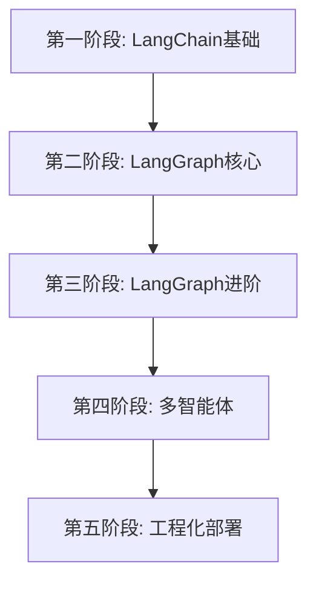

# 🎓 AI Agent 开发教程 - 完整教程汇总

> 从前端到 AI Agent：用 TypeScript 精通 LangChain.js 和 LangGraph.js

## 📚 教程完成情况

### ✅ 第一阶段：LangChain.js 基础（已完成）

掌握大模型交互和工具调用的基础知识。

| 课程 | 状态 | 核心内容 |
|-----|------|---------|
| [01-大模型交互入门](./01-阶段一-LangChain基础/01-大模型交互入门.md) | ✅ | invoke、async/await、temperature |
| [02-消息系统详解](./01-阶段一-LangChain基础/02-消息系统详解.md) | ✅ | 4种消息类型、对话历史管理 |
| [03-提示词模板](./01-阶段一-LangChain基础/03-提示词模板.md) | ✅ | ChatPromptTemplate、变量插值 |
| [04-结构化输出](./01-阶段一-LangChain基础/04-结构化输出.md) | ✅ | Zod Schema、类型安全 |
| [05-工具系统核心](./01-阶段一-LangChain基础/05-工具系统核心.md) | ✅ | Function Calling、工具定义 |
| [实战项目](./01-阶段一-LangChain基础/实战项目-智能旅游助手.md) | ✅ | 综合应用：智能旅游助手 |

**预计学习时间**：3-5 天（每天 2-3 小时）

---

### ✅ 第二阶段：LangGraph.js 核心（已完成）

掌握状态机、节点、边和 ReAct Agent 的构建。

| 课程 | 状态 | 核心内容 |
|-----|------|---------|
| [01-为什么需要LangGraph](./02-阶段二-LangGraph核心/01-为什么需要LangGraph.md) | ✅ | 循环推理、Agent 本质 |
| [02-状态机概念](./02-阶段二-LangGraph核心/02-状态机概念.md) | ✅ | State、Reducer、Annotation |
| [03-节点与边](./02-阶段二-LangGraph核心/03-节点与边.md) | ✅ | 节点函数、普通边、条件边 |
| [04-条件路由](./02-阶段二-LangGraph核心/04-条件路由.md) | ✅ | 路由函数、多分支、循环 |
| [05-构建ReAct-Agent](./02-阶段二-LangGraph核心/05-构建ReAct-Agent.md) | ✅ | 完整 Agent 循环、预构建 Agent |

**预计学习时间**：4-6 天（每天 2-3 小时）

---

### ✅ 第三阶段：LangGraph.js 进阶（核心课程已完成）

掌握持久化、人机协同等生产级特性。

| 课程 | 状态 | 核心内容 |
|-----|------|---------|
| [01-持久化与记忆](./03-阶段三-LangGraph进阶/01-持久化与记忆.md) | ✅ | Checkpointer、thread_id、多用户 |
| [02-人机协同](./03-阶段三-LangGraph进阶/02-人机协同.md) | ✅ | interrupt、暂停与恢复 |
| 03-状态修改与回退 | 📝 | updateState、时间旅行 |
| 04-错误处理 | 📝 | 异常捕获、重试机制 |

**预计学习时间**：3-4 天（每天 2-3 小时）

---

### ✅ 第四阶段：多智能体系统（核心课程已完成）

掌握多 Agent 协作模式。

| 课程 | 状态 | 核心内容 |
|-----|------|---------|
| [01-多智能体概述](./04-阶段四-多智能体/01-多智能体概述.md) | ✅ | 协作模式、角色分工 |
| 02-主管员工模式 | 📝 | Supervisor Pattern |
| 03-网状对等模式 | 📝 | Network Pattern |
| 04-子图嵌套 | 📝 | Sub-graphs |

**预计学习时间**：3-4 天（每天 2-3 小时）

---

### ✅ 第五阶段：工程化部署（核心课程已完成）

掌握生产环境部署和前端集成。

| 课程 | 状态 | 核心内容 |
|-----|------|---------|
| [01-流式输出](./05-阶段五-工程化部署/01-流式输出.md) | ✅ | streamEvents、Next.js集成 |
| 02-可观测性 | 📝 | LangSmith、调试技巧 |
| 03-Next.js集成 | 📝 | API Routes、Server Actions |
| 04-React前端开发 | 📝 | 组件设计、状态管理 |

**预计学习时间**：4-5 天（每天 2-3 小时）

---

## 🎯 学习路线图

### 推荐学习顺序



### 每阶段学习方法

1. **理论学习**（30%时间）
   - 阅读课程文档
   - 理解核心概念
   - 对照前端类比

2. **实战编码**（70%时间）
   - 跟随示例代码
   - 完成练习任务
   - 实现实战项目

---

## 📖 核心知识点速查

### LangChain.js 核心 API

```typescript
// 1. 初始化 LLM
const llm = new ChatOpenAI({ modelName: 'gpt-4o-mini' });

// 2. 调用
const response = await llm.invoke('你好');

// 3. 消息系统
import { HumanMessage, AIMessage, SystemMessage } from '@langchain/core/messages';

// 4. 提示词模板
import { ChatPromptTemplate } from '@langchain/core/prompts';
const template = ChatPromptTemplate.fromMessages([...]);

// 5. 结构化输出
const llm = new ChatOpenAI().withStructuredOutput(schema);

// 6. 工具定义
import { tool } from '@langchain/core/tools';
const myTool = tool(async ({...}) => {...}, {...});
```

### LangGraph.js 核心 API

```typescript
// 1. State 定义
import { Annotation } from '@langchain/langgraph';
const State = Annotation.Root({
  messages: Annotation<BaseMessage[]>({
    reducer: (x, y) => x.concat(y),
  }),
});

// 2. 构建图
import { StateGraph } from '@langchain/langgraph';
const graph = new StateGraph(State)
  .addNode('node1', node1Func)
  .addEdge('node1', 'node2')
  .addConditionalEdges('node2', router, {...})
  .compile();

// 3. 运行
const result = await graph.invoke({ messages: [...] });

// 4. 流式
for await (const chunk of graph.stream(input)) {
  console.log(chunk);
}

// 5. 持久化
import { MemorySaver } from '@langchain/langgraph';
const memory = new MemorySaver();
const graph = builder.compile({ checkpointer: memory });

await graph.invoke(input, {
  configurable: { thread_id: 'user-123' },
});
```

---

## 🛠️ 项目模板

### 创建新项目的标准步骤

```bash
# 1. 初始化项目
mkdir my-agent && cd my-agent
npm init -y

# 2. 安装依赖
npm install langchain @langchain/openai @langchain/anthropic @langchain/langgraph
npm install zod dotenv
npm install -D typescript tsx @types/node

# 3. 配置 TypeScript
npx tsc --init

# 4. 配置 package.json
npm pkg set type="module"
npm pkg set scripts.dev="tsx watch src/index.ts"
npm pkg set scripts.start="tsx src/index.ts"

# 5. 配置环境变量
cat > .env << EOF
OPENAI_API_KEY=your_key
ANTHROPIC_API_KEY=your_key
EOF

# 6. 创建入口文件
mkdir src
touch src/index.ts
```

---

## 💡 常见问题汇总

### 环境配置

**Q: Node.js 版本要求？**
A: 推荐 Node.js 20+

**Q: 如何选择模型？**
A:
- 学习：gpt-4o-mini（便宜）
- 生产：claude-3-5-sonnet（强大）

### 开发调试

**Q: 如何查看完整的 Prompt？**
A: 使用 LangSmith 或设置 `verbose: true`

**Q: 如何限制 Token 消耗？**
A:
1. 设置 `maxTokens`
2. 限制对话历史长度
3. 使用更小的模型

### 部署上线

**Q: 如何部署到 Vercel？**
A: 使用 Next.js，API Routes 放在 `app/api/`

**Q: 如何保护 API Key？**
A: 使用环境变量，不要提交到 Git

---

## 🎓 学习资源

### 官方文档

- [LangChain.js 文档](https://js.langchain.com/)
- [LangGraph.js 文档](https://langchain-ai.github.io/langgraphjs/)
- [OpenAI API 文档](https://platform.openai.com/docs)
- [Anthropic Claude 文档](https://docs.anthropic.com/)

### 社区资源

- [LangChain Discord](https://discord.gg/langchain)
- [GitHub Discussions](https://github.com/langchain-ai/langchainjs/discussions)

---

## 🚀 下一步学习建议

### 完成教程后，你可以：

1. **构建个人项目**
   - 智能笔记助手
   - 代码审查工具
   - 客服机器人
   - 数据分析助手

2. **深入专题**
   - RAG（检索增强生成）
   - Long-term Memory
   - Multi-modal Agents
   - Agent 性能优化

3. **开源贡献**
   - 提交 Bug 报告
   - 贡献代码
   - 分享经验

---

## 📞 获取帮助

遇到问题？
1. 查看课程 FAQ
2. 搜索 GitHub Issues
3. 在 Discord 提问
4. 阅读官方文档

---

**开始你的 AI Agent 开发之旅吧！** 🚀

从 [第一阶段第一课](./01-阶段一-LangChain基础/01-大模型交互入门.md) 开始，一步步成为 AI Agent 专家！
